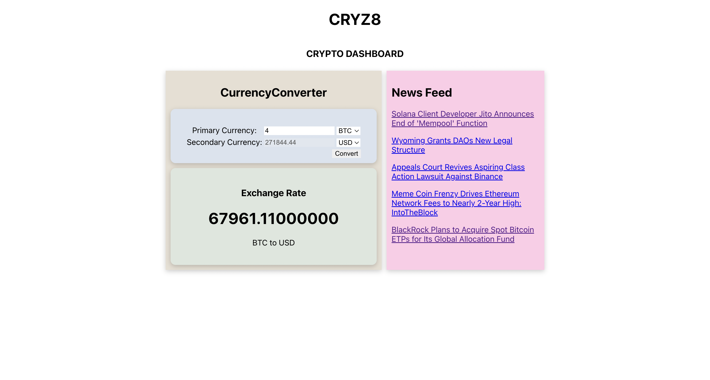

# CRYZ8-Crypto Dashboard 🪙

Crypto Dashboard is a comprehensive web application developed using React and Node.js, aimed at providing users with a seamless experience in currency conversion and keeping them aware of the latest developments in the cryptocurrency world. This README will provide a detailed overview of the project, its features, technologies utilized, installation steps, configuration requirements and usage instructions.

## Features

### Currency Conversion
The application offers a robust currency conversion functionality, leveraging the Currency Converter API from RapidAPI. Users can effortlessly convert one currency into another, facilitating seamless financial transactions and global trading activities.

### Crypto Newsfeed
Stay informed with the latest news and updates in the cryptocurrency domain through the integration of the Crypto Newsfeed API. The dashboard presents users with real-time news articles, market insights, and analysis, ensuring they are equipped with the most relevant information to make informed decisions.

## Technologies Used

### Frontend
- React: A popular JavaScript library for building interactive user interfaces.
- HTML/CSS: Fundamental web technologies for structuring and styling the application's frontend.
- Axios: A promise-based HTTP client for making asynchronous HTTP requests to fetch data from APIs.

### Backend
- Node.js: A JavaScript runtime environment for executing server-side code.
- Express.js: A minimal and flexible Node.js web application framework used for building robust APIs.

### APIs
- RapidAPI: A platform that provides access to thousands of APIs for integration into applications.
    - Currency Converter API: Offers comprehensive currency conversion functionalities, allowing seamless exchange between different currencies.
    - Crypto Newsfeed API: Delivers real-time news articles, market insights, and analysis related to cryptocurrencies.

## Installation

To set up the Crypto Dashboard locally on your machine, follow these steps:

1. Clone the repository:

```bash
git clone https://github.com/SequenZee/CRYZ8.git
```

2. Navigate to the project directory:
```bash
cd CRYZ8
```

3. Install Dependencies:
```bash
npm install
```

4. Create .env file:
```bash
REACT_APP_RAPID_API_KEY= "YOUR_API_KEY"
```

## Configuration

Before running the application, you need to obtain API keys for the Currency Converter API and Crypto Newsfeed API from RapidAPI. Once obtained, replace the placeholder API keys in the "index.js".

## Usage

1. Start the frontend:
```bash
npm run start:frontend
```

2. Start the backend server:
```bash
npm run start:backend
```

## Output




